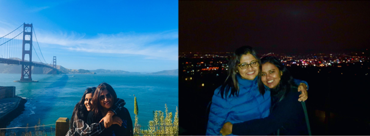

<h1 style="background-color: YELLOW"> to Mumma, with love. </h1>

.JPG)
 

 <b> Happy Birthday to my super-mumma who brings us happiness and warmth every day 
 

.JPG)

 <b> I love you Mumma! Happy Happy Birthday and this webpage is to document all the ways in which you light up our lives, and you make it look EASY! From being patient with your potor-potor bokboking, hot-tempered lil monkeys to forgetting our names (even though there's only TWO of us!) - we love you and we appreciate you more than you know.  </b> 
 

 
<h3 style="background-color:YELLOW"> LIFE-CHANGING QUOTES BY MUMMA </h3> 
  

>
- "Rishaaaaaaaaaaaaaaaaaaaa"
- "Dishiiiiiiiiiiiiiiiiiiii"
- "Uff khaali paka paka kotha"
- "Oops..."
- "Dishuri... Rishuri..."
- "Khide pachhe? Ektu fol ba Half Cup doodh kheye nao"
- "Disha fruits khachho toh?"
- "Disha ki holo? No awaz? Kemon acho?"
- "Potor Potor Kotha Bolbi na Toh"

<h3 style="background-color:BISQUE"> Remember when I left for Hong Kong and I drew this for you guys? </h3> 
.jpeg)
 
 

<h3 style="background-color:YELLOW">   THANK YOU FOR PLAYING MULTIPLE ROLES IN OUR LIVES </h3> 
<h4 style="background-color:MOCCASIN"> You play all these roles in MY life </h4>

<h4 style="background-color:MOCCASIN"> And you play all these roles too! </h4>

 
 

<h3 style="background-color:YELLOW"> CROSSWORD  </h3> 

    <iframe border="0" src="https://crosswordlabs.com/embed/for-prithvi" style="flex:1; width:100%; padding:5px 0px 0 5px; border:3px solid black; "></iframe>
    <a target="_blank" style="align-self:center; font-size:12px; color:black; padding-top:10px; text-decoration:none;text-align:center" href="https://crosswordlabs.com">Crossword Puzzle Maker</a>

 
 

<h3 style="background-color:YELLOW"> OLD MEMORIES  </h3> 
**Time Capsule-worthy baby photos**

### I love you Mumma and I miss you onek onek onek
## Disha

 
 

 
<h4 style="background-color:PEACHPUFF"> Lots of squishie chotkano hugs from your Disha </h4> 

 

 
 

<h3 style="background-color:PALEGREEN"> Support or Feedback </h3> 
Having trouble viewing this webpage? 
Check out the [documentation](https://help.github.com/categories/github-pages-basics/) or email me at
<a href="mailto:ashmitaroye@icloud.com">ashmitaroye@icloud.com</a> and I’ll help sort it out.
